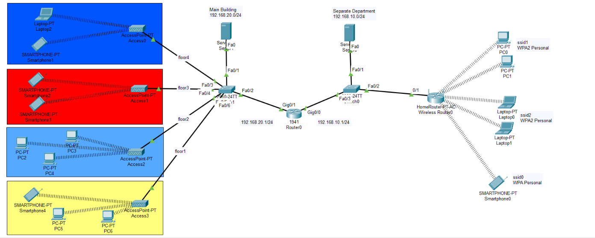

# Wireless Network Design — Multi-Floor Office + Remote Department (Cisco Packet Tracer)

A complete wireless network infrastructure simulating a real-world company: a four-floor main office building plus a separate remote department, fully interconnected and secured.

## Network Overview

## Design Requirements & Implementation
- **Main office building**: 4 floors, each representing a distinct department, subnetted under `192.168.20.0/24`
- **Remote department**: a separate site subnetted under `192.168.10.0/24`, interconnected to the main building through a central router
- **Wireless access per floor**: each floor is equipped with its own Access Point / wireless router, providing wireless connectivity to all end devices (PCs and smartphones) on that floor
- **Unique SSID per floor**: each floor's wireless network is identified by its own SSID, keeping departments logically separated at the wireless layer
- **WPA2 security**: every wireless network is secured with WPA2 Personal, ensuring encrypted, authenticated wireless communication throughout the topology

## Files
- `final_project.pkt` — the complete Packet Tracer topology and device configuration
- `topology.png` — network diagram

## Tech Stack
- Cisco Packet Tracer
- Wireless Routers & Access Points
- WPA2 wireless security

## How to Open
1. Install [Cisco Packet Tracer](https://www.netacad.com/courses/packet-tracer) (free with a Cisco Networking Academy account)
2. Open `final_project.pkt` to explore the full topology, wireless configuration, and device settings
